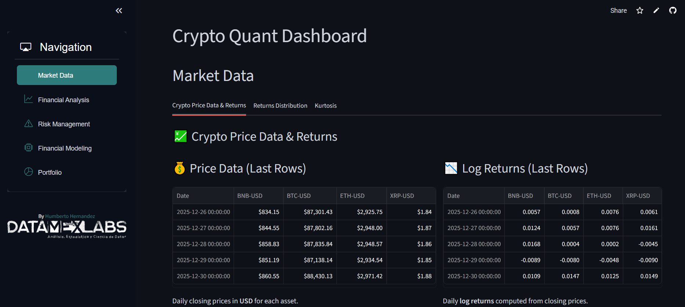

# Crypto Quant Dashboard

Crypto Quant Dashboard is a Streamlit web application designed to analyze cryptocurrency market data, compute financial metrics, and visualize risk and return distributions.  
It provides traders, analysts, and researchers with an interactive interface to explore crypto assets through quantitative methods.

---

## 🚀 Features

- **Market Data Explorer**  
  Fetches historical price data for selected cryptocurrencies using `yfinance`.

- **Financial Metrics**  
  Calculates annualized returns, volatility, Sharpe ratio, maximum drawdown, and Conditional Value at Risk (CVaR).

- **Risk Management Tools**  
  Includes Value at Risk (VaR), CVaR, and drawdown analysis.

- **Financial Modeling**  
  Supports ARIMA, GARCH, and Holt-Winters time series models for forecasting.

- **Portfolio Analysis**  
  Visualizes cumulative returns, rolling maxima, and comparative performance across assets.

- **Interactive Navigation**  
  Sidebar menu with sections for Market Data, Financial Analysis, Risk Management, Financial Modeling, and Portfolio.

---

## 📊 Screenshot

Below is a preview of the dashboard interface:



---

## 🛠️ Tech Stack

- **Frontend:** [Streamlit](https://streamlit.io/)  
- **Navigation:** `streamlit-option-menu`  
- **Data:** `yfinance` for crypto price data  
- **Analysis:** `pandas`, `numpy`, `scipy`, `statsmodels`, `arch`  
- **Visualization:** `matplotlib`, `seaborn`

---

## 📂 Project Structure

cryptoquantdashboard/
│
├── app.py                # Main Streamlit app
├── requirements.txt      # Python dependencies
├── datamexlabs_bn.png    # Company logo
├── screenshot_qcd_PNG    # App screenshot
└── README.md             # Project documentation

---

## 👤 Author

By [Humberto Hernandez](https://www.upwork.com/freelancers/~01c12fd1dd98e5960a)  
DATAMEXLABS — *Análisis, Estadística y Ciencia de Datos*

---

## ⚡ Getting Started

1. Clone the repository:
   ```bash
   git clone https://github.com/yourusername/cryptoquantdashboard.git
   cd cryptoquantdashboard
